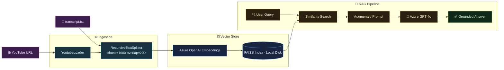

# 📺 YT-RAG Bot: Semantic Video Intelligence
> **Transform any YouTube video into an interactive, high-fidelity knowledge base using RAG.**


---

## 📝 Overview
**YT-RAG Bot** is a production-ready system designed to perform deep analysis on YouTube transcripts. It bridges the gap between passive video watching and active learning by allowing users to query video content with instant, precise answers.

Built with **LangChain** and **Azure OpenAI**, this project automates the entire process: from extracting a video's transcript to creating a searchable local database that grounds an AI's answers in actual video facts.

### 🎯 Why This Matters
In an era of information overload, finding specific details in long videos is time-consuming. This project is a powerful tool for:
- **Students & Researchers**: Instantly find specific academic concepts or data points within hours of lectures or interviews.
- **Content Consumers**: Quickly verify facts or summarize key takeaways from documentaries and podcasts.
- **Developers**: A blueprint for building robust, modular RAG applications with multi-resource cloud integration.

---

## 💬 Example Usage

**Target Video**: *DeepMind's Demis Hassabis on the Future of AI*

**User Query**:
> *"What is the main objective of the nuclear fusion research mentioned?"*

**Assistant Response**:
> *"The objective is to accelerate scientific discovery in fusion research. The team collaborated with EPFL (Swiss Federal Institute of Technology) to use AI for controlling plasma in fusion reactors, potentially bringing us closer to a clean energy future."*

---

## 🚀 Key Features
- ⚡ **Smart URL Handling**: Automatically recognizes standard, short, and mobile YouTube links.
- 🔍 **Intelligent Search**: Uses **FAISS** to find relevant information even if the exact keywords don't match.
- 🛡️ **Fact-Grounded Answers**: Specialized AI prompts prevent "hallucinations" by restricting the model to the video's transcript.
- 🌐 **Flexible Cloud Setup**: Native support for using separate Azure OpenAI resources for chat and embeddings.
- 💾 **Fast Local Storage**: Saves video data locally to disk, ensuring sub-second response times and reduced API costs.
- 🔄 **Local Fallback**: Supports manual transcript uploads if automated scraping is blocked.
- 🛠️ **Diagnostic Suite**: Built-in tools to verify cloud connections and discover Azure deployments automatically.

---

## 🛠 Tech Stack
| Category | Tools & Frameworks |
| :--- | :--- |
| **Orchestration** | [LangChain](https://www.langchain.com/) (LCEL) |
| **Generative AI** | [Azure OpenAI](https://azure.microsoft.com/en-us/products/ai-services/openai-service) (GPT-4o) |
| **Embeddings** | Azure OpenAI `text-embedding-3-small` |
| **Search Engine** | [FAISS](https://github.com/facebookresearch/faiss) (L2 Similarity) |
| **Data Ingestion** | `youtube-transcript-api`, `YoutubeLoader` |
| **Utilities** | `python-dotenv`, `RecursiveCharacterTextSplitter` |

---

## ⚙️ Installation

### 1. Clone the Repository
```bash
git clone https://github.com/SwayamAg/YT-RAG_BOT.git
cd YT-RAG_BOT
```

### 2. Configure Environment Variables
Create a `.env` file in the root directory. This project supports **separate resources** for the Chat model and Embeddings:
```env
# Chat Model Config
AZURE_OPENAI_API_KEY=your_primary_key
AZURE_OPENAI_ENDPOINT=https://your-resource.openai.azure.com/
AZURE_OPENAI_DEPLOYMENT=your-gpt-deployment
AZURE_OPENAI_API_VERSION=2024-02-01

# Embeddings Config (Optional Override)
AZURE_EMBEDDINGS_ENDPOINT=https://your-embed-resource.openai.azure.com/
AZURE_EMBEDDINGS_API_KEY=your_secondary_key
AZURE_EMBEDDINGS_DEPLOYMENT=your-embedding-deployment

# Defaults
YOUTUBE_URL=https://www.youtube.com/watch?v=Gfr50f6ZBvo
```

### 3. Setup Virtual Environment
```bash
python -m venv .venv
.\.venv\Scripts\activate  # Windows
pip install -r requirements.txt
```

---

## 🚀 Usage

### Starting the Chat
```bash
python main.py
```
1. **Target Selection**: Paste a YouTube URL or press **Enter** for the default video.
2. **Interact**: Ask questions about the video content.
3. **Commands**: `clear` to reset the UI, `exit` to quit.

### Diagnostic Tools
Verify your Azure configuration:
```bash
python debug_azure.py
```

---

## 📁 Project Structure
```text
YT-RAG_BOT/
├── main.py            # CLI Interface & Orchestration
├── ingestion.py       # Data Pipeline (Load -> Split -> Index)
├── rag_chain.py       # RAG Logic & Prompt Engineering
├── utils.py           # Video Metadata & URL Utilities
├── config.py          # Configuration & Azure Factories
├── debug_azure.py     # Connection Diagnostic Script
├── find_deployments.py # Automated Deployment Discovery
├── summary.md         # Technical Deep-Dive Documentation
└── requirements.txt   # Dependency Management
```

## 🏗 System Architecture


## 👨‍💻 Model & Pipeline Details
- **Text Processing**: Uses a recursive strategy to split transcripts into 1000-character segments with a 200-character overlap for context preservation.
- **Retrieval**: Similarity-based retrieval returning the top 4 most relevant transcript sections.
- **LLM Configuration**: Powered by GPT-4o with a low temperature (0.2) to ensure factual, non-creative answers.

---

## 👨‍💻 Made by Swayam

- **Name**: Swayam Agarwal  
- **LinkedIn**: https://www.linkedin.com/in/swayam-agarwal/  
- **GitHub**: https://github.com/SwayamAg  
- **Email**: swayamagarwal19@gmail.com  

---
