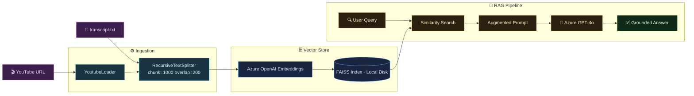

# 📺 YT-RAG Bot: Semantic Video Intelligence
> **Transform any YouTube video into an interactive, high-fidelity knowledge base using RAG.**

---

## 📝 Overview
**YT-RAG Bot** is a production-ready **Retrieval-Augmented Generation (RAG)** system designed to perform deep semantic analysis on YouTube transcripts. It bridges the gap between passive video consumption and active knowledge extraction by allowing users to query video content with sub-second precision.

Built with **LangChain (LCEL)** and **Azure OpenAI**, this project implements a full ETL pipeline: from dynamic URL extraction and recursive character splitting to persistent vector indexing and context-grounded response generation.

## 🚀 Key Features
- ⚡ **Dynamic ID Extraction**: Robust Regex-based parsing for standard, short, and mobile YouTube URLs.
- 🔍 **Semantic Search**: Powered by **FAISS** (Facebook AI Similarity Search) for high-dimensional vector retrieval.
- 🛡️ **Anti-Hallucination Guardrails**: Specialized system prompts restrict the LLM to provide answers strictly from the transcript.
- 🌐 **Dual-Resource Architecture**: Native support for separate Azure OpenAI resources (multi-region/multi-endpoint) for LLM and Embeddings.
- 💾 **Local Disk Persistence**: High-performance serialization of vector indexes to eliminate redundant API costs.
- 🔄 **Local Fallback Mode**: Built-in support for `transcript.txt` to bypass YouTube scraper blocking.
- 🛠️ **DevOps Diagnostic Suite**: Custom scripts for connectivity testing and automated deployment discovery.

## 🛠 Tech Stack
| Category | Tools & Frameworks |
| :--- | :--- |
| **Orchestration** | [LangChain](https://www.langchain.com/) (LCEL) |
| **Generative AI** | [Azure OpenAI](https://azure.microsoft.com/en-us/products/ai-services/openai-service) (GPT-4o) |
| **Embeddings** | Azure OpenAI `text-embedding-3-small` |
| **Vector Engine** | [FAISS](https://github.com/facebookresearch/faiss) (L2 Similarity) |
| **Data Ingestion** | `youtube-transcript-api`, `YoutubeLoader` |
| **Utilities** | `python-dotenv`, `RecursiveCharacterTextSplitter` |

## ⚙️ Installation

### 1. Clone the Repository
```bash
git clone https://github.com/SwayamAg/YT-RAG_BOT.git
cd YT-RAG_BOT
```

### 2. Configure Environment Variables
Create a `.env` file in the root directory. This project supports **separate resources** for LLM and Embeddings:
```env
# LLM Config
AZURE_OPENAI_API_KEY=your_primary_key
AZURE_OPENAI_ENDPOINT=https://your-resource.openai.azure.com/
AZURE_OPENAI_DEPLOYMENT=your-gpt-deployment
AZURE_OPENAI_API_VERSION=2024-02-01

# Embeddings Config (Optional Override)
AZURE_EMBEDDINGS_ENDPOINT=https://your-embed-resource.openai.azure.com/
AZURE_EMBEDDINGS_API_KEY=your_secondary_key
AZURE_EMBEDDINGS_DEPLOYMENT=your-embedding-deployment

# Defaults
YOUTUBE_URL=https://www.youtube.com/watch?v=Gfr50f6ZBvo
```

### 3. Setup Virtual Environment
```bash
python -m venv .venv
.\.venv\Scripts\activate  # Windows
pip install -r requirements.txt
```

---

## 🚀 Usage

### Starting the Chat
```bash
python main.py
```
1. **Input**: Paste a YouTube URL or press **Enter** for the default video.
2. **Interact**: Ask questions like *"What are the technical limitations discussed in the video?"*
3. **Commands**: `clear` to reset the UI, `exit` to quit.

### Diagnostic Tools
Verify your Azure configuration:
```bash
python debug_azure.py
```

---

## 📁 Project Structure
```text
YT-RAG_BOT/
├── main.py            # CLI UI & Application Orchestration
├── ingestion.py       # ETL Pipeline (Extract -> Transform -> Load)
├── rag_chain.py       # LCEL Logic & Augmented Prompting
├── utils.py           # YouTube URL & Title Metadata Fetcher
├── config.py          # Dual-Resource Client Factories
├── debug_azure.py     # Connection Diagnostic Script
├── find_deployments.py # Automated Deployment Discovery
├── summary.md         # Technical Deep-Dive & Methodology
└── requirements.txt   # Dependency Management
```

## 🏗 System Architecture


## 👨‍💻 Model & Pipeline Details
- **Chunking Strategy**: `RecursiveCharacterTextSplitter` optimizing for paragraph and sentence boundaries.
- **Retriever**: Similarity Search with **k=4** (Top 4 relevant segments).
- **Prompting**: System-level constraints enforcing zero hallucination policy.
- **LLM**: GPT-4o configured with `temperature=0.2` for factual consistency.

## 🚀 Future Roadmap
- [ ] **Multi-Video RAG**: Cross-video analysis for entire playlists.
- [ ] **Streamlit UI**: Browser-based interactive dashboard.
- [ ] **Audio-to-Text**: whisper-large-v3 integration for non-captioned videos.

---

## 👨‍💻 Made by Swayam

- **Name**: Swayam Agarwal  
- **LinkedIn**: https://www.linkedin.com/in/swayam-agarwal/  
- **GitHub**: https://github.com/SwayamAg  
- **Email**: swayamagarwal19@gmail.com  

---
