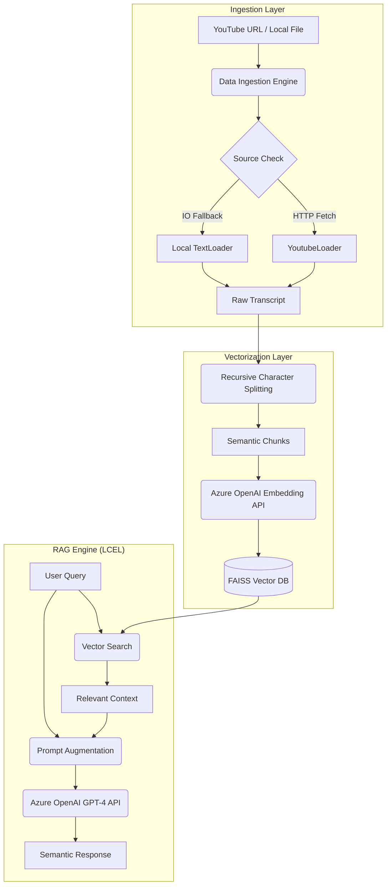

# YT-RAG Bot: Technical Architecture & Methodology

## 🛠 SDE Perspective: Design Goals
As a senior developer, this project was architected with three core principles in mind:
1.  **Modularity**: Separation of concerns between configuration, data ingestion, and business logic.
2.  **Robustness**: Handling network-sensitive operations (YouTube scraping) with automated fallbacks.
3.  **Configurability**: Supporting complex enterprise Azure setups (multi-resource/multi-endpoint).

---

## 🏗 System Architecture & Data Flow



---

## 🔬 Technical Deep Dive

### 1. Multi-Resource Azure Integration
In production environments, LLMs (GPT-4) and Embedding models (text-embedding-3-small) are often hosted on separate resources or regions to balance quota limits and availability. 
- **The Solution**: Our `config.py` uses a prioritized lookup logic. It allows for a single global key/endpoint but gracefully handles overrides for embeddings (`AZURE_EMBEDDINGS_ENDPOINT`).
- **Validation**: The `validate_env()` function ensures all permutations of these variables are correctly set before the app initializes.

### 2. Semantic Chunking (Recursive Character Splitting)
**Why it matters**: Naive splitting (e.g., every 100 words) can cut through a middle of a sentence, destroying meaning.
- **Our Approach**: We use a recursive strategy that respects natural hierarchy (`\n\n` -> `\n` -> ` `).
- **Strategy**: `chunk_size=1000` with `chunk_overlap=200`. This ensures that even if a concept spans two chunks, the shared overlap allows the retriever to capture the context effectively.

### 3. Vector Search: FAISS vs Traditional Search
- **Traditional (Keyword)**: Fails on semantic intent (e.g., user asks for "AI benefits", transcript says "advantages of machine learning").
- **FAISS (L2 Distance)**: Maps text to a high-dimensional vector space. Search is a mathematical distance calculation.
- **Persistence**: We serialize the FAISS index to disk. This is critical for performance; once a video is indexed, sub-second responses are achieved without ever calling the YouTube API or Embedding API again.

---

## 🚀 How to Run (SDE Quickstart)

### 1. Configuration (`.env`)
Populate the following variables. Note the optional separate embedding resource.
```env
AZURE_OPENAI_API_KEY=...
AZURE_OPENAI_ENDPOINT=...
AZURE_OPENAI_DEPLOYMENT=...
AZURE_EMBEDDINGS_ENDPOINT=... # Optional override
AZURE_EMBEDDINGS_API_KEY=...  # Optional override
AZURE_EMBEDDINGS_DEPLOYMENT=...
```

### 2. Execution
```bash
# Setup
python -m venv .venv
.\.venv\Scripts\activate
pip install -r requirements.txt

# Run
python main.py
```

---

## 💬 Input/Output Examples

**Query:** *"What is the main takeaway regarding scientific discovery?"*
**Retrieved Context**: *"...Demis Hassabis notes that AI is not just a tool for optimization, but a fundamental accelerator for the scientific method itself..."*
**Response:** *"The primary takeaway is that AI acts as a fundamental catalyst for scientific breakthroughs, enabling researchers to navigate complex problem spaces (like fusion energy or protein folding) at unprecedented speeds."*

---

## 🛠 Project Components
- `config.py`: Configuration factory and validation.
- `utils.py`: High-performance utility functions (Regex URL extraction).
- `ingestion.py`: The ETL pipeline (Extract, Transform, Load).
- `rag_chain.py`: Declarative pipeline definition using LangChain LCEL.
- `main.py`: CLI orchestration and state management.
